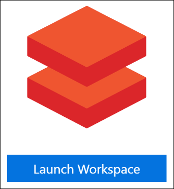
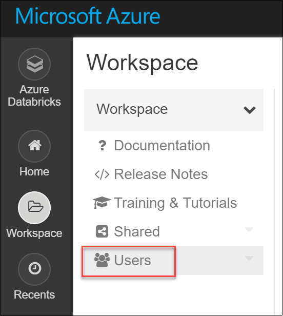
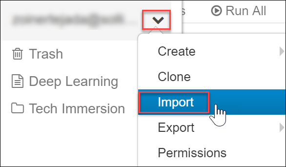
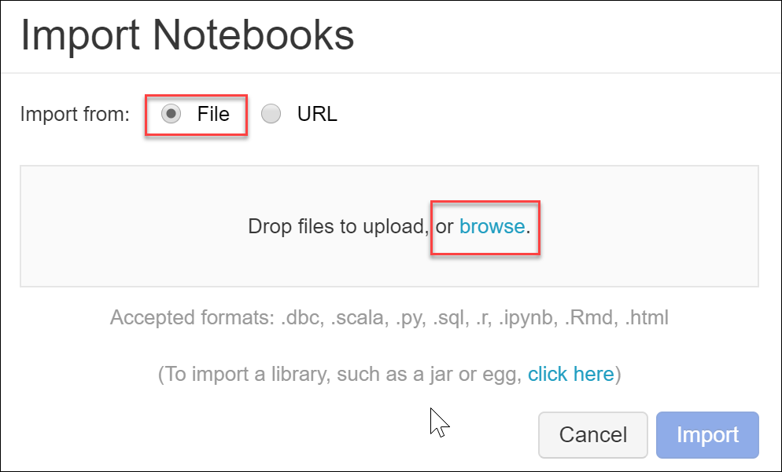

- [Task 1: Train and deploy a deep learning model](#task-1-train-and-deploy-a-deep-learning-model)

## Task 1: Train and deploy a deep learning model 

In this task, you will train a deep learning model to classify the descriptions of car components provided by technicians as compliant or non-compliant, convert it to ONNX, and deploy it as a web service. To accomplish this, you will use an Azure Databricks notebook to explore the transaction and account data.

1. From the Azure Portal, navigate to your deployed Azure Databricks workspace and select **Launch Workspace**.

    

2. Within the Workspace, using the command bar on the left, select **Workspace**, **Users** and select your username (the entry with house icon).

    

3. In the blade that appears, select the downwards pointing chevron next to your username, and select **Import**.

    

4. On the Import Notebooks dialog, select **browse** and then select `Deep_Learning.dbc` from your lab files folder for this experience (C:\lab-files\ai\4) and select **Import**.

    

5. The notebook should appear. This is the notebook you will use in completing this lab. Follow the instructions in the notebook, and then return to this guide to complete the experience.