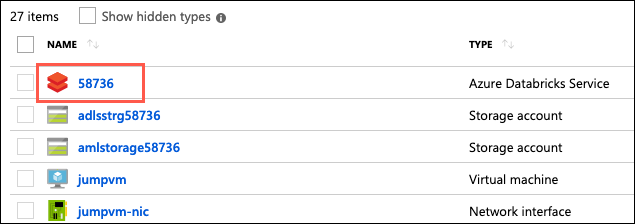
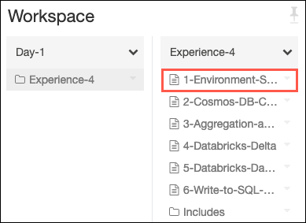

# Day 1, Experience 4 - Delivering the modern data warehouse with Cosmos DB, Azure SQL Data Warehouse, Azure Databricks, and Azure Data Factory

Like many organizations, ContosoAuto generates data from numerous system, each of which has its own location and format, including structured, unstructured, and semi-structured data. They would like the ability to combine and analyze these disparate datasets in order to gain actionable insights that can help them operate their business more efficiently.

In this experience, ​​you will see how Azure Data Factory (ADF), Azure Databricks, and Azure SQL Data Warehouse (SQL DW) can be used together to build a modern data warehouse. You will start by using Azure Data Factory (ADF) to automate the movement of data in various formats gathered from various sources, including Cosmos DB, into a centralized repository, Azure Data Lake Storage Gen2 (ADLS Gen2) in this case. You will then use Azure Databricks to prepare and analyze those data, and finally write the aggregations to Azure SQL Data Warehouse (SQL DW).

As part of the process, you will also use Databricks to connect to the Cosmos DB Change Feed to stream near-real-time vehicle telemetry data directly into your SQL DW using Spark Structured Streaming.

- [Day 1, Experience 4 - Delivering the modern data warehouse with Cosmos DB, Azure SQL Data Warehouse, Azure Databricks, and Azure Data Factory](#day-1-experience-4---delivering-the-modern-data-warehouse-with-cosmos-db-azure-sql-data-warehouse-azure-databricks-and-azure-data-factory)
  - [Task 1: Execute ADF Pipeline to copy data](#task-1-execute-adf-pipeline-to-copy-data)
  - [Task 2: Read streaming data from Cosmos DB using Databricks](#task-2-read-streaming-data-from-cosmos-db-using-databricks)
  - [Task 3: Perform data aggregation and summarization](#task-3-perform-data-aggregation-and-summarization)
  - [Task 4: Persisting data to Databricks Delta tables](#task-4-persisting-data-to-databricks-delta-tables)
  - [Task 5: Visualizations and dashboards with Databricks](#task-5-visualizations-and-dashboards-with-databricks)
  - [Task 6: Send summarized data to Azure SQL DW](#task-6-send-summarized-data-to-azure-sql-dw)
  - [Task 7: Generate dashboards in Power BI with data from Databricks and Azure SQL DW](#task-7-generate-dashboards-in-power-bi-with-data-from-databricks-and-azure-sql-dw)

## Task 1: Execute ADF Pipeline to copy data

In this task, you will review and execute ADF pipelines to copy data from various sources, including Cosmos DB, in your ADLS Gen2 filesystem.

1. In a web browser, navigate to the [Azure portal](https://portal.azure.com), select **Resource groups** from the left-hand menu, and then select the resource group named **tech-immersion**.

    

2. Select **tech-immersion-data-factory** from the list of resources.

    

3. On the Data Factory blade, select the **Author & Monitor** tile to launch the Azure Data Factory management page.

    

4. On the Azure Data Factory page, select the **Author** (pencil) icon from the left-hand menu.

    

5. On the ADF Author page, select **Pipelines** to expand the list, and then select the **CopyData** pipeline from the list.

    

    > The `CopyData` pipeline consists of three copy activities. Two connect to your SQL Server 2019 instance to retrieve vehicle data from tables there. The third connects to Cosmos DB to retrieve batch vehicle telemetry data.

    TODO: Add steps to review the copy activities?

6. On the pipeline toolbar, select **Trigger** to run the `CopyData` pipeline, and then select **Finish** on the Pipeline Run dialog. You will receive a notification that they `CopyData` pipeline is running.

    

7. To observe the pipeline run, select the **Monitor** icon from the left-hand menu, which will bring up a list of active and recent pipeline runs.

    

    > On the pipeline runs monitor page, you can see all active and recent pipeline runs. The **Status** field provide and indication of the state of the pipeline run, from In Progress to Failed or Canceled. You also have the option to filter by Status and set custom date ranges to get a specific status and time period.

8. Select the **Activity Runs** icon under Actions for the currently running pipeline to view the status of the individual activities which make up the pipeline.

    

    > The **Activity Runs** view allows you to monitor individual activities within your pipelines. In this view, you can see the amount of time each activity took to execute, as well as select the various icons under Actions to view the inputs, outputs, and details of each activity run. As with pipeline runs, you are provided with the Status of each activity.

9. When the pipeline run is complete, return to the **Author** page by selecting the pencil icon in the left-hand menu.

## Task 2: Read streaming data from Cosmos DB using Databricks

You have now used ADF to move data from various sources, including Cosmos DB, into an ADLS Gen2 filesystem. In this task, you will use an Azure Databricks notebook to extend the use of Cosmos DB further, by creating a connection to your Cosmos DB instance, using the Azure Cosmos DB Spark Connector, and querying streaming data from the Cosmos DB Change Feed.

1. In the [Azure portal](https://portal.azure.com), select **Resource groups**, select **Resource groups** from the left-hand menu, and then select the resource group named **tech-immersion**.

    

2. Select **tech-immersion-databricks** from the list of resources.

    

3. On the Azure Databricks Service blade, select **Launch Workspace**.

   

4. In your Databricks workspace, select **Workspace** from the left-hand menu, and then select **Shared**.

5. In the shared workspace, select the **Tech-Immersion** folder, followed by the **Day 1** and **Experience 4** folders. Then select the notebook named **1-Cosmos-DB-Change-Feed**.

   

6. In the **1-Cosmos-DB-Change-Feed** notebook, follow the instructions to complete the remaining steps of this task.

## Task 3: Perform data aggregation and summarization

In this task, you will using Databricks to perform data preparation, aggregation and summarization with both batch and streaming data.

1. In your Databricks workspace, select **Workspace** from the left-hand menu, then select **Shared**.

2. In the shared workspace, select the **Tech-Immersion** folder, followed by the **Day 1** and **Experience 4** folders. Then select the notebook named **2-Aggregation-and-Summarization**.

   

3. In the **2-Aggregation-and-Summarization** notebook, follow the instructions to complete the remaining steps of this task.

## Task 4: Persisting data to Databricks Delta tables

In this task, you will see how Databricks Delta provides capabilities previous unavailable for updating records in an Hive table by using the UPSERT method to update existing records and insert new records.

1. In your Databricks workspace, select **Workspace** from the left-hand menu, then select **Shared**.

2. In the shared workspace, select the **Tech-Immersion** folder, followed by the **Day 1** and **Experience 4** folders. Then select the notebook named **3-Databricks-Delta**.

   

3. In the **3-Databricks-Delta** notebook, follow the instructions to complete the remaining steps of this task.

## Task 5: Visualizations and dashboards with Databricks

In this task, you will use visualizations configured within a Databricks notebook to build a dashboard displaying your data aggregations.

1. In your Databricks workspace, select **Workspace** from the left-hand menu, then select **Shared**.

2. In the shared workspace, select the **Tech-Immersion** folder, followed by the **Day 1** and **Experience 4** folders. Then select the notebook named **4-Databricks-Dashboards**.

   

3. In the **4-Databricks-Dashboards** notebook, follow the instructions to complete the remaining steps of this task.

## Task 6: Send summarized data to Azure SQL DW

In this task, you will using the Azure SQL Data Warehouse connector to write aggregated data from Databricks into your SQL DW. You will also apply aggregations to streaming data from the Cosmos DB Change Feed, and streaming the data directly into your Azure SQL DW from Databricks.

1. In your Databricks workspace, select **Workspace** from the left-hand menu, then select **Shared**.

2. In the shared workspace, select the **Tech-Immersion** folder, followed by the **Day 1** and **Experience 4** folders. Then select the notebook named **5-Write-to-SQL-DW**.

   

3. In the **5-Write-to-SQL-DW** notebook, follow the instructions to complete the remaining steps of this task.

## Task 7: Generate dashboards in Power BI with data from Databricks and Azure SQL DW

In this task, you will create queries in Power BI to read data from Databricks and Azure SQL DW for reports and dashboards.