# Setup steps for the DBA version of Experience 1

Complete the steps below to deploy and configure SQL Server 2019 for the [Day 1, DBA Experience](../../../../day1-exp1/dba.md) workshop.

- [Setup steps for the DBA version of Experience 1](#Setup-steps-for-the-DBA-version-of-Experience-1)
  - [Lab VM requirements](#Lab-VM-requirements)
  - [Experience requirements](#Experience-requirements)
  - [Set up HGS VM](#Set-up-HGS-VM)
  - [Set up SQL Server 2019 VM](#Set-up-SQL-Server-2019-VM)
    - [Create Windows Server 2019 Datacenter VM](#Create-Windows-Server-2019-Datacenter-VM)
    - [Install SQL Server 2019](#Install-SQL-Server-2019)
    - [Configure the SQL Server computer as a guarded host](#Configure-the-SQL-Server-computer-as-a-guarded-host)
    - [Configure SQL Server 2019](#Configure-SQL-Server-2019)
    - [Enable Always Encrypted with secure enclaves in SQL Server](#Enable-Always-Encrypted-with-secure-enclaves-in-SQL-Server)
    - [Install a sales database per user](#Install-a-sales-database-per-user)
    - [Configure attendee databases](#Configure-attendee-databases)
  - [Set up SQL Server 2008 R2 VM](#Set-up-SQL-Server-2008-R2-VM)
    - [Provision SQL Server 2008 R2 on Windows Server 2008 R2 VM](#Provision-SQL-Server-2008-R2-on-Windows-Server-2008-R2-VM)
    - [Configure SQL Server 2008 R2 VM](#Configure-SQL-Server-2008-R2-VM)
    - [Restore ContosoAutoDb database](#Restore-ContosoAutoDb-database)
    - [Create an SMB network share on the sqlserver2008r2 VM](#Create-an-SMB-network-share-on-the-sqlserver2008r2-VM)
  - [Create SQL Server 2017 VM in Azure](#Create-SQL-Server-2017-VM-in-Azure)

## Lab VM requirements

- SQL Server Management Studio 18 must be installed on the lab VM.

> IMPORTANT: A single instance of the HGS and SQL Server 2019 VMs will be shared by all attendees.

## Experience requirements

- Windows Server 2019 Datacenter for Host Guardian Service (HGS)
- Windows Server 2019 Datacenter running SQL Server 2019
- SQL Server 2017 on Windows Server 2016
- SQL Server 2008 R2 on Windows Server 2008 R2

## Set up HGS VM

A VM needs to be provisioned to run the Host Guardian Service (HGS), which is required for Always Encrypted with secure enclaves. The HGS computer is needed for enclave attestation.

1. Provision a Windows Server 2019 Datacenter VM in Azure

   - **Name**: hgs-service-vm
   - **Image**: Windows Server 2019 Datacenter
   - **Size**: Standard D4 v3
     - This must be a Dv3 or Ev3 size, as it must support nested virtualization.
       - **NOTE**: Dv3 and Ev3 VMs are not available in every region, so if those don't appear, select a different region.
     - Minimum requirements: 2 CPUs, 8 GB RAM, 100 GB storage
   - **Username**: demouser
   - **Password**: Password.1!!
   - **Inbound ports**: Allow RDP (3389)

2. When the server provisioning complets, open an RDP connection to the hgs-service-vm, and sign in using the credentials:

   - **Username**: demouser
   - **Password**: Password.1!!

3. Open an elevated Windows PowerShell console and run the following PowerShell command to install the Host Guardian Service role:

   ```powershell
   Install-WindowsFeature -Name HostGuardianServiceRole -IncludeManagementTools -Restart
   ```

4. After the computer restarts, sign in to the HGS computer again and open an elevated Windows PowerShell console. Run the following commands to install the Host Guardian Services and configure its domain.

   ```powershell
   $adminPassword = ConvertTo-SecureString -AsPlainText 'Password.1!!' -Force
   Install-HgsServer -HgsDomainName 'tech-immersion.local' -SafeModeAdministratorPassword $adminPassword -Restart
   ```

5. After the computer reboots again, sign in with your admin account (which is now also a Domain Admin), open an elevated Windows PowerShell console, and configure host key attestation for your HGS instance.

   ```powershell
   Initialize-HgsAttestation -HgsServiceName 'hgs' -TrustHostKey
   ```

6. Find the IP address of the HGS computer by running the following command. Save the IP address for later steps.

   ```powershell
   Get-NetIPAddress
   ```

7. Create a new folder named `C:\hostkeys` on the hgs-service-vm.

8. Right-click the new `hostkeys` folder, and select **Properties**.

9. In the Properties menu, select the Sharing tab, and then select **Share**.

10. On the **Share** dialog, ensure the **demouser** account has **Read/Write** listed under Permissions level, and then select **Share**.

    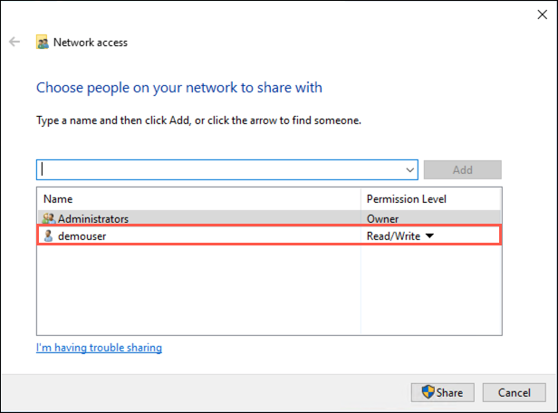

11. Note the network path of the shared folder, as it will be needed when configuring the SQL Server 2019 VM as a guarded host.

    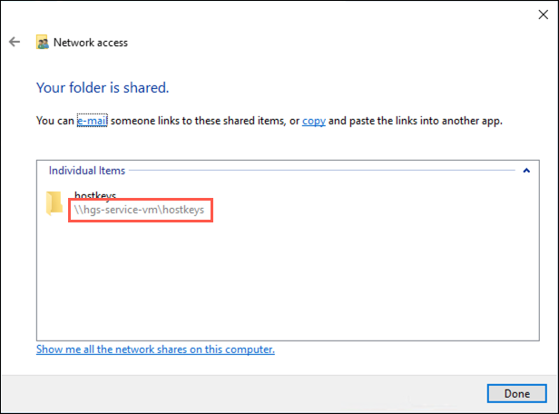

## Set up SQL Server 2019 VM

Provision a Windows Server 2019 Datacenter. Once provisioned install and configure SQL Server 2019 on the VM.

> **IMPORTANT**: This must be a separate VM from the HGS VM.

### Create Windows Server 2019 Datacenter VM

1. Create a new Windows Server 2019 Datacenter VM.

   

2. On the Create a virtual machine **Basics** tab, enter the following:

   - **Virtual machine name**: Enter **sql-server-2019**
   - **Image**: Windows Server 2019 Datacenter
   - **Size**: Select Standard D8s v3
     - This must be a Dv3 or Ev3 size, as it must support nested virtualization.
       - **NOTE**: Dv3 and Ev3 VMs are not available in every region, so if those don't appear, select a different region.
   - **Username**: demouser
   - **Password**: Password.1!!
   - Allow selected inbound ports: 3389 (RDP)

   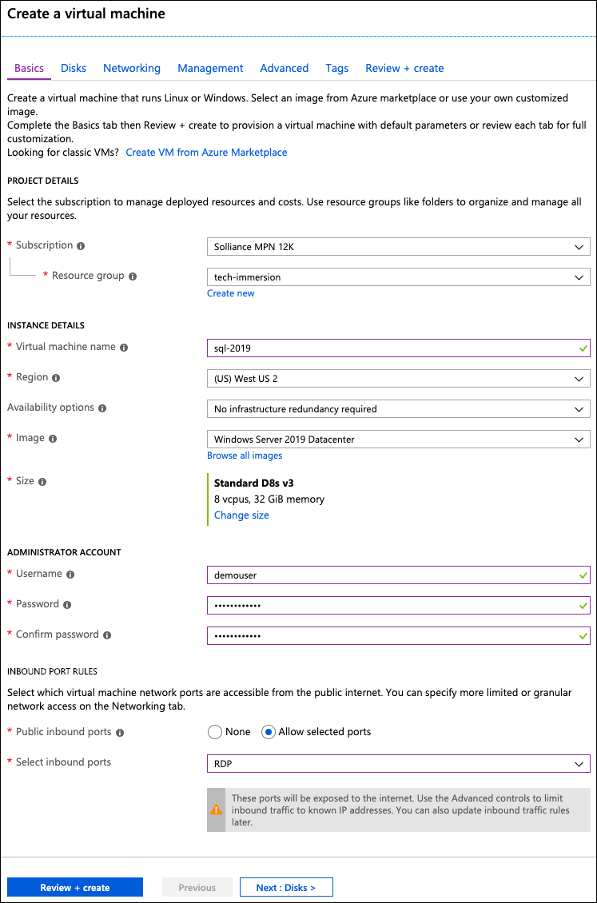

3. Select **Review + create**.

4. On the Review + create blade, select **Create** to provision the Windows Server 2019 Datacenter VM.

5. Once the VM finishes provisioning, navigate to the sql-2019 VM blade in the Azure portal, select **Networking** under Settings in the left-hand menu, and then select **Add inbound port rule**.

6. On the **Add inbound security rule blade**, select **Basic** and then enter the following:

    - **Service**: Select MS SQL.
    - **Port ranges**: Value will be set to 1433.
    - **Priority**: Accept the default priority value.
    - **Name**: Enter SqlServer.

    

7. Select **Add**.

### Install SQL Server 2019

1. Open an RDP connection to the sql-2019 VM, and sign in using the credentials:

   - **Username**: demouser
   - **Password**: Password.1!!

2. On the sql-2019 VM, open a web browser and download a copy of the SQL Server 2019 preview from <https://www.microsoft.com/en-us/evalcenter/evaluate-sql-server-2019-ctp>.

3. Run the downloaded installer, choosing a Basic installation

   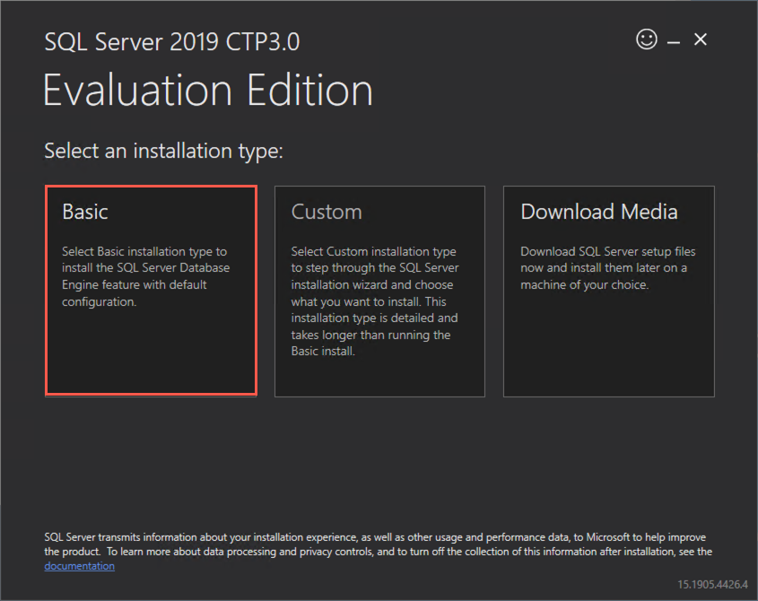

4. When the installation completes, select **Install SSMS** in the dialog.

   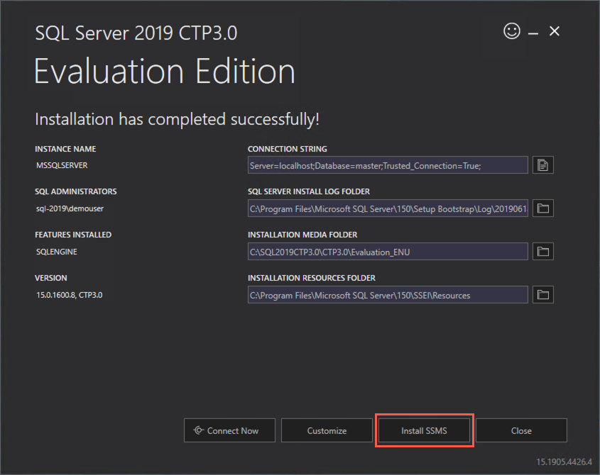

5. In the browser windows that appears, select the **Download SQL Server Management Studio 18.x** link to start the download.

   

6. Run the downloaded file to install SSMS, and select **Install** to begin the installation.

   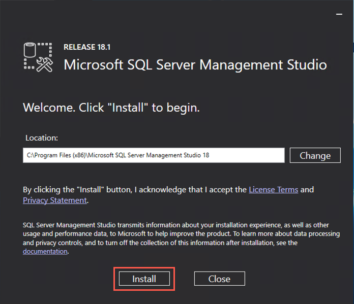

7. Select **Restart** on the SSMS installation dialog to complete the installation.

   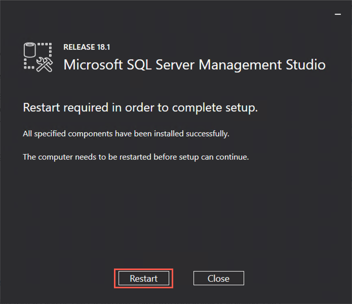

8. Log back into the sql-2019 VM when the restart completes for the next task.

### Configure the SQL Server computer as a guarded host

1. Install the Guarded Host feature, which will also install Hyper-V (if it is not installed already), and then restart the computer, by running the following command from an elevated PowerShell console.

   ```powershell
   Enable-WindowsOptionalFeature -Online -FeatureName HostGuardian -All
   ```

2. When prompted, enter **Y** and press Enter to restart the computer.

   

3. After the VM restarts, sign in again, open an elevated PowerShell prompt, and enter the following commands to remove the VBS requirement for platform security features, and then restart the computer.

   ```powershell
   Set-ItemProperty -Path HKLM:\SYSTEM\CurrentControlSet\Control\DeviceGuard -Name RequirePlatformSecurityFeatures -Value 0
   Restart-Computer
   ```

4. Sign in to the sql-2019 VM again, and open an elevated PowerShell console. Enter the following commands to generate a unique host key, and export the resulting public key to a file.

   ```powershell
   Set-HgsClientHostKey
   Get-HgsClientHostKey -Path C:\hostkey.cer
   ```

5. Once the key creation completes, copy the key file from `C:\hostkey.cer`. Open a Windows FileExplorer window and navigate to the hostkeys share you created on the hgs-service-vm by entering `\\hgs-service-vm\hostkeys` in the address bar. Paste the `hostkey.cer` file in the share. This will place a copy of the certificate on the HGS VM.

6. Next, open an RDP connection to the hgs-service-vm, and sign in using the credentials:

   - **Username**: demouser
   - **Password**: Password.1!!

7. On the hgs-service-vm, open an elevated Windows PowerShell console and run the following PowerShell command to register the host key of your SQL Server computer with HGS:

   ```powershell
   Add-HgsAttestationHostKey -Name "sql-2019" -Path C:\hostkeys\hostkey.cer
   ```

8. Return to your RDP session on the sql-2019 VM, and enter the following command in an elevated Windows PowerShell console. This command tells there SQL Server computer where to attest. Make sure you specify the IP address or the DNS name of your HGS computer in both address locations.

    ```powershell
    # use http, and not https
    Set-HgsClientConfiguration -AttestationServerUrl http://<public-ip-address-of-hgs-service-vm>/Attestation -KeyProtectionServerUrl http://<public-ip-address-of-hgs-service-vm>/KeyProtection/
    ```

9. You will see output from the command above providing details about the guarded host.

   

10. The `AttestationServerUrl` value should be added to the list of values provided to lab attendees. They will need this to connect enable Always Encrypted with secure enclaves in SSMS.

### Configure SQL Server 2019

The steps below open access to the sql-2019 VM for SQL Server (port 1433), and configure the user account that will be used by workshop attendees.

1. Open Windows Defender Firewall and Advanced Security, and add a new inbound rule to open port 1433 to TCP traffic for all connections, and name the rule **SqlServer**.

2. Next, open the SQL Server 2019 CTP3.0 Configuration Manager on the sql-2019 VM.

3. In SQL Server Configuration Manager, expand SQL Server Network Configuration, and select Protocols for MSSQLSERVER.

   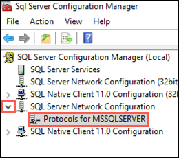

4. Double-click TCP/IP, and in the properties dialog select **Yes** for Enabled, and then select **OK**.

   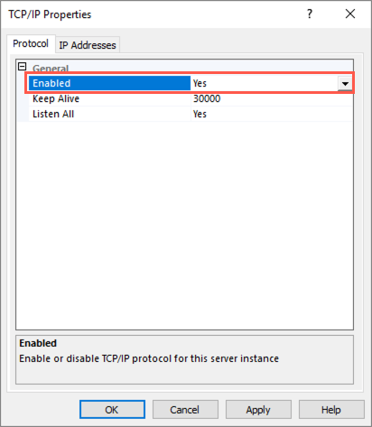

   > **NOTE**: You will see a prompt that the change will not take effect until the service is restarted. Select OK. You will restart the service below.

5. Manually copy the `sql-2019-server-config.sql` and `sql-2019-per-user-config.sql` files from `environment-setup/data/1/dba` onto the sql-2019 VM in a folder named `C:\sqlscripts`.

6. Open SQL Server Management Studio 18 (SSMS), and connect to the sql-2019 instance using Windows authentication.

   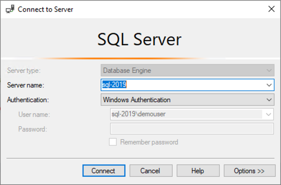

7. Once logged in, select the **Open file** icon on the toolbar, and open `C:\sqlscripts\sql-2019-server-config.sql`.

8. Run the script by selecting **Execute** on the toolbar.

9. Right-click sql-2019 server in the SSMS Object explorer, and select **Restart** to restart the MSSQLSERVER service.

### Enable Always Encrypted with secure enclaves in SQL Server

In this step, you will enable the functionality of Always Encrypted using enclaves in the SQL Server 2019 instance.

1. Return to the RDP connection to the sql-2019-vm, and open SSMS. Connect to the SQL Server instance as using Windows authentication and the `demouser` account, and then open a new query window.

2. Set the secure enclave type to Virtualization Based Security (VBS).

   ```sql
   EXEC sys.sp_configure 'column encryption enclave type', 1;
   RECONFIGURE;
   ```

3. Restart the SQL Server service for the previous change to take effect. You can restart the service in SSMS by right-clicking on the connected server in Object Explorer and selecting **Restart**.

4. Confirm the secure enclave is now loaded by running the following query:

   ```sql
   SELECT [name], [value], [value_in_use] FROM sys.configurations
   WHERE [name] = 'column encryption enclave type';
   ```

5. The query should return the following result:

   |name|value|value_in_use|
   |----|-----|------------|
   |column encryption enclave type|1|1|

6. Finally, enable rich computations on encrypted columns, by running the following query:

   ```sql
   DBCC traceon(127,-1);
   ```

   > **NOTE**: Rich computations are disabled by default in SQL Server 2019 preview. They need to be enabled using the above statement after each restart of your SQL Server instance.

### Install a sales database per user

On the SQL Server 2019 VM, a copy of the `sales` database needs to be created, *per attendee*, using the naming convention `sales_XXXXX`, where XXXXX is the unique identifier assigned to each account. Workshop users will only connect to the SQL Server 2019 instance via SSMS, so this step needs to be done for them, before the workshop.

1. Download the `tpcxbb_1gb.bak` file from [here](https://databricksdemostore.blob.core.windows.net/data/contoso-auto/tpcxbb_1gb.bak).

2. In SSMS, restore a copy of the database for each user account created for the workshop.

3. Rename each database to **sales_XXXXX**, where XXXXX is the unique identifier assigned to each workshop attendee.

### Configure attendee databases

Workshop users will only connect to the SQL Server 2019 instance via SSMS, so this step needs to be done for them, before the workshop.

1. Open SSMS on the sql-2019 VM, and for each attendee **sales_XXXXX** database, run the `C:\sqlscripts\sql-2019-server-config.sql` script file to set up the required login account.

    > **IMPORTANT**: In the script file, replace XXXXX in the `USE` statement with the unique identifier assigned to the user.

## Set up SQL Server 2008 R2 VM

In this task, you will provision another virtual machine (VM) in Azure to host an instance of SQL Server 2008 R2. The VM will use the SQL Server 2008 R2 SP3 Standard on Windows Server 2008 R2 image.

> **NOTE**: An older version of Windows Server is being used because SQL Server 2008 R2 is not supported on Windows Server 2016.

### Provision SQL Server 2008 R2 on Windows Server 2008 R2 VM

1. In the [Azure portal](https://portal.azure.com/), select **+Create a resource**, and enter "SQL Server 2008R2SP3 on Windows Server 2008R2" into the Search the Marketplace box.

2. On the **SQL Server 2008 R2 SP3 on Windows Server 2008 R2** blade, select **SQL Server R2 SP3 Standard on Windows Server 2008 R2** for the software plan and then select **Create**.

    

3. On the Create a virtual machine **Basics** tab, set the following configuration:

    - Instance Details:

        - **Virtual machine name**: Enter sql-2008.
        - **Availability options**: Select no infrastructure redundancy required.
        - **Image**: Leave SQL Server 2008 R2 SP3 Standard on Windows Server 2008 R2 selected.
        - **Size**: Select Standard D2s v3 from the list and then select **Accept**.

    - Administrator Account:

        - **Username**: Enter **demouser**
        - **Password**: Enter **Password.1!!**

    - Inbound Port Rules:

        - **Public inbound ports**: Choose Allow selected ports.
        - **Select inbound ports**: Select RDP (3389) in the list.

4. Select **Review + create** to validate the configuration.

5. On the **Review + create** tab, ensure the Validation passed message is displayed, and then select **Create** to provision the virtual machine.

6. Once the VM finishes provisioning, navigate to the sql-2008 VM blade in the Azure portal, select **Networking** under Settings in the left-hand menu, and then select **Add inbound port rule**.

7. On the **Add inbound security rule blade**, select **Basic** and then enter the following:

    - **Service**: Select MS SQL.
    - **Port ranges**: Value will be set to 1433.
    - **Priority**: Accept the default priority value.
    - **Name**: Enter SqlServer.

    

8. Select **Add**.

### Configure SQL Server 2008 R2 VM

> TODO: Update. This can use the shared SQLSERVER2008R2 VM created for D1-E3, and the same database.

In this task, you will open an RDP connection to the sql-2008 VM, disable Internet Explorer Enhanced Security Configuration, and add a firewall rule to open port 1433 to inbound TCP traffic. You will also install Data Migration Assistant (DMA).

1. Open an RDP connection the sql-2008 VM, using the following credentials:

    - **User name**: demouser
    - **Password**: Password.1!!

2. Once logged in, launch the **Server Manager**. This should start automatically, but you can access it via the Start menu if it does not.

3. On the **Server Manager** view, select **Configure IE ESC** under Security Information.

    

4. In the Internet Explorer Enhanced Security Configuration dialog, select **Off** under both Administrators and Users, and then select **OK**.

    

5. Back in the Server Manager, expand **Configuration** and **Windows Firewall with Advanced Security**.

    

6. Right-click on **Inbound Rules** and then select **New Rule** from the context menu.

   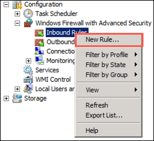

7. In the New Inbound Rule Wizard, under Rule Type, select **Port**, then select **Next**.

   

8. In the Protocol and Ports dialog, use the default **TCP**, and enter **1433** in the Specific local ports text box, and then select **Next**.

   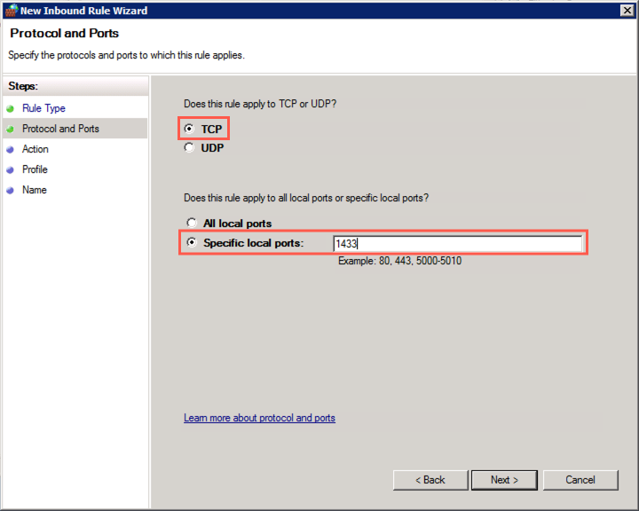

9. In the Action dialog, select **Allow the connection**, and then select **Next**.

   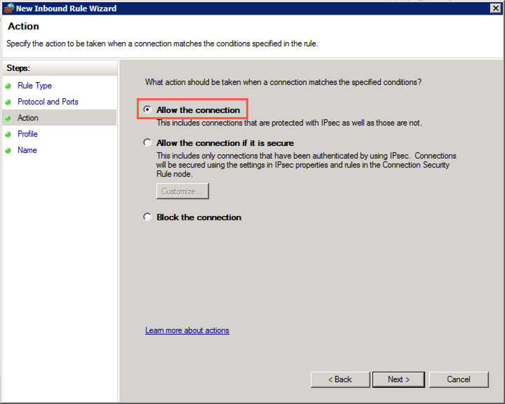

10. In the Profile step, check **Domain**, **Private**, and **Public**, then select **Next**.

    

11. On the Name screen, enter **SqlServer** for the name, and select **Finish**.

    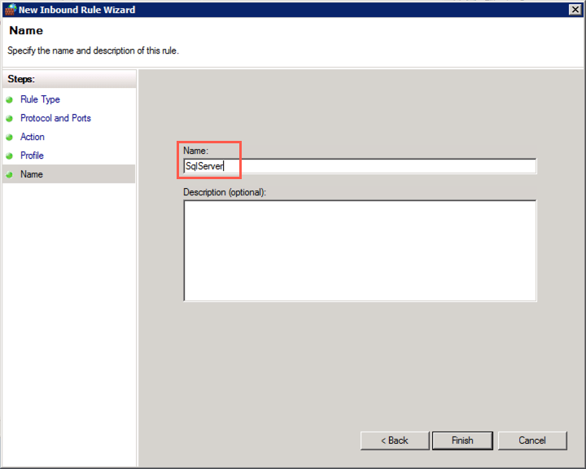

12. Close the Server Manager.

13. Next, you will install DMA by navigating to <https://www.microsoft.com/en-us/download/details.aspx?id=53595> in a web browser on the sql-2008 VM, and then selecting the **Download** button.

    

14. Run the downloaded installer.

15. Select **Next** on each of the screens, accepting to the license terms and privacy policy in the process.

16. Select **Install** on the Privacy Policy screen to begin the installation.

17. On the final screen, select **Finish** to close the installer.

    

### Restore ContosoAutoDb database

- A `ContosoAutoDb` database should be created, from the **ContosoAutoDb.bak** file (found under lab-files/data/1), as a shared read-only database for attendees.

### Create an SMB network share on the sqlserver2008r2 VM

Create a new SMB network share on the SqlServer2008R2 VM named `\\sqlserver2008r2\db-backups`. This will be the folder used by DMA for transferring backups of the `ContosoAutoDb` database during the database migration process.

1. On the SqlServer2008R2 VM, open **Windows Explorer**, expand **Computer** in the tree view, select **Windows (C:)**, and then select **New folder** in the top menu.

2. Name the new folder **db-backups**, then right-click the folder and select **Share with** and **Specific people** in the context menu.

3. In the File Sharing dialog, ensure the **demouser** is listed with a **Read/Write** permission level, and then select **Share**.

4. In the **Network discovery and file sharing** dialog, select the default value of **No, make the network that I am connected to a private network**.

5. Back on the File Sharing dialog, note the path of the shared folder, `\\sqlserver2008r2\db-backups`, and select **Done** to complete the sharing process.

6. The shared folder path should be provided to attendees for use during the database migration using DMA.

## Create SQL Server 2017 VM in Azure

Provision a SQL Server 2017 on Windows 2016 VM in Azure.

Cannot be a shared resource.

- Username: demouser
- Password: Password.1!!
- During configuration, open port 1433 to public
- Enable Mixed mode authentication
- Must be in the same region as the sqlserver2008r2 VM, so it can read from the `\\sqlserver2008r2\db-backups` network share.

On the sql-2017 VM, create a folder on the root named `Contoso` (i.e., `C:\Contoso`). This is the folder that will be used as the target for restoring the `ContosoAutoDb` by the Database Migration Assistant, and it must exist prior to running the DMA.
